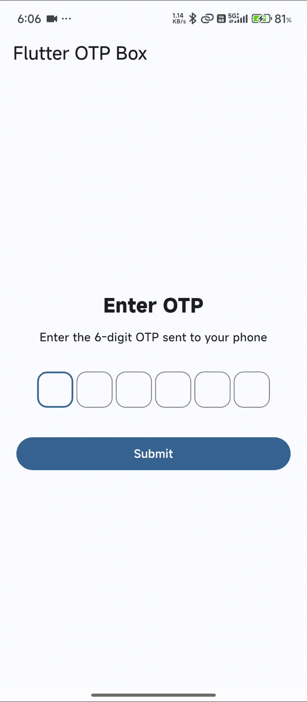

# Flutter OTP Box

A customizable OTP input widget for Flutter with automatic OTP autofill support.

## Features

* 4, 6, 8 or custom OTP length
* Automatic OTP autofill using the device
* Numeric input only
* Paste OTP directly into the field
* Automatically limits input to the configured length
* Auto focus support
* Customizable box size and spacing
* Obscure OTP digits
* `onChanged` callback
* `onCompleted` callback
* Controller support
* Clear and focus methods
* Material 3 compatible

## Preview

<p align="center">
  
</p>

## Installation

Add `flutter_otp_box` to your `pubspec.yaml`:

```yaml
dependencies:
  flutter_otp_box:
    git:
      url: https://github.com/RuhanShaikh123/flutter_OTP_Box_-Auto-Fill-.git
      ref: stage
```

Then run:

```bash
flutter pub get
```

## Basic Usage

```dart
import 'package:flutter/material.dart';
import 'package:flutter_otp_box/flutter_otp_box.dart';

class OtpScreen extends StatefulWidget {
  const OtpScreen({super.key});

  @override
  State<OtpScreen> createState() => _OtpScreenState();
}

class _OtpScreenState extends State<OtpScreen> {
  late final OtpController otpController;

  @override
  void initState() {
    super.initState();
    otpController = OtpController();
  }

  @override
  void dispose() {
    otpController.dispose();
    super.dispose();
  }

  @override
  Widget build(BuildContext context) {
    return Scaffold(
      body: Center(
        child: OtpBox(
          controller: otpController,
          config: const OtpConfig(
            length: 6,
            autoFocus: true,
            enableAutofill: true,
          ),
          onChanged: (value) {
            debugPrint('OTP: $value');
          },
          onCompleted: (value) {
            debugPrint('OTP completed: $value');
          },
        ),
      ),
    );
  }
}
```

## Configuration

`OtpConfig` provides the following options:

| Property         | Type     | Default | Description                         |
| ---------------- | -------- | ------: | ----------------------------------- |
| `length`         | `int`    |     `6` | Number of OTP digits                |
| `autoFocus`      | `bool`   |  `true` | Automatically focuses the OTP field |
| `enableAutofill` | `bool`   |  `true` | Enables device OTP autofill         |
| `obscureText`    | `bool`   | `false` | Hides entered OTP digits            |
| `boxSize`        | `double` |    `52` | Size of each OTP box                |
| `spacing`        | `double` |    `10` | Space between OTP boxes             |

### Example

```dart
OtpBox(
  config: const OtpConfig(
    length: 6,
    autoFocus: true,
    enableAutofill: true,
    obscureText: false,
    boxSize: 52,
    spacing: 10,
  ),
)
```

## Controller

Use `OtpController` when you need to access or control the OTP value.

```dart
final controller = OtpController();
```

Get the entered OTP:

```dart
final otp = controller.value;
```

Clear the OTP:

```dart
controller.clear();
```

Focus the OTP field:

```dart
controller.focus();
```

Remember to dispose the controller:

```dart
@override
void dispose() {
  controller.dispose();
  super.dispose();
}
```

## OTP Autofill

The package supports the device's built-in OTP autofill mechanism.

Enable it with:

```dart
OtpConfig(
  enableAutofill: true,
)
```

When an OTP is received, the device or keyboard can suggest the OTP automatically.

> OTP autofill is handled by the operating system and keyboard. The package does not directly read SMS messages.

## Callbacks

### `onChanged`

Called whenever the OTP value changes.

```dart
onChanged: (value) {
  debugPrint(value);
},
```

### `onCompleted`

Called when the OTP reaches the configured length.

```dart
onCompleted: (value) {
  debugPrint('OTP completed: $value');
},
```

## Different OTP Lengths

The widget supports different OTP lengths:

```dart
OtpBox(
  config: const OtpConfig(
    length: 4,
  ),
)
```

```dart
OtpBox(
  config: const OtpConfig(
    length: 6,
  ),
)
```

```dart
OtpBox(
  config: const OtpConfig(
    length: 8,
  ),
)
```

## Obscure OTP

To hide the entered digits:

```dart
OtpBox(
  config: const OtpConfig(
    length: 6,
    obscureText: true,
  ),
)
```

## Example

A complete working example is available in the `example` directory.

Run the example with:

```bash
cd example
flutter run
```

## Requirements

* Flutter
* Dart
* Android or iOS device/emulator

For OTP autofill, testing on a real device is recommended.

## License

This project is licensed under the MIT License.
